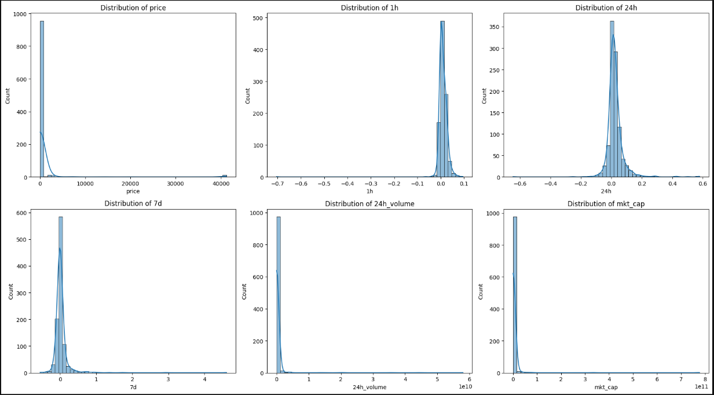
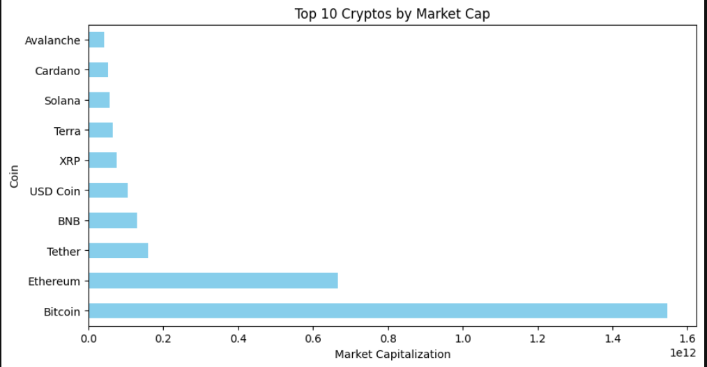

# 📊 Exploratory Data Analysis (EDA) Report

This report summarizes the exploration of historical cryptocurrency data, focusing on understanding patterns, identifying outliers, and preparing data for modeling.

---

## 📁 Dataset Overview

- Combined dataset from two CSVs (2022-03-16 & 2022-03-17)
- Total records after concatenation: `994`
- Columns: `16` before feature engineering, `18+` after

---

## 🧼 Missing Value Treatment

| Column         | Missing % | Action Taken                  |
|----------------|-----------|-------------------------------|
| `1h`           | Few rows  | Replaced with column mean     |
| `24h`          | Few rows  | Replaced with column mean     |
| `7d`           | Few rows  | Replaced with column mean     |
| Rolling Features | Some     | `bfill()` to preserve rows    |

---

## 🔍 Feature Distributions (Before Cleaning)

- `price`, `volume`, and `market_cap` are highly skewed
- Presence of outliers in:
  - `price_change`
  - `volume_change`
  - `rolling_std_price_7d`
  - `liquidity_ratio`

---

## 📈 Visual Insights

### Distribution of All Numeric Features

- Most cryptos are low-priced; few with extreme high values (outliers)

---

### Top 10 Crypto coin by Market cap

- Bitcoin have the highest Market Capital

---

### 🔗 Correlation Heatmap

Top correlated features with target:
- Relative Volume → 36%
- Log Volume      → 6.4%

## ⚠️ Outlier Detection
Used IQR and quantile range

Outlier Capping at 1st and 99th percentile for robust ML performance

## 🧠 Key Insights
Outlier removal reduced dataset from 994 → 208 (⬇ not ideal)

Instead, outlier capping preserved full size and gave better model results

Volume-related features (log-transformed) showed better correlation with target

## ✅ Conclusion
The EDA helped uncover:

Skewed distributions that required scaling

Outliers best handled with capping, not deletion

Rolling and log features that improved signal-to-noise

Correlated features used for modeling

