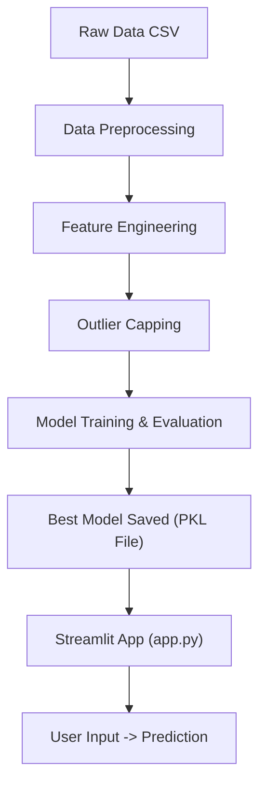

# 🧠 High-Level Design (HLD) – Crypto Liquidity Ratio Prediction

This document outlines the **overall architecture**, components, and technology used in this project.

---

## 🎯 Problem Statement

Predict the **Rolling Liquidity Ratio** of a cryptocurrency using various market indicators such as price, volume, and volatility using machine learning techniques.

---

## 🧩 System Components

1. **Data Collection**
   - Source: Historical cryptocurrency CSVs
   - Combined 2 datasets (2022-03-16 and 2022-03-17)

2. **Data Preprocessing**
   - Handled missing values
   - Converted columns to numeric
   - Treated outliers using capping

3. **Feature Engineering**
   - Rolling averages, volatility, momentum, and liquidity metrics
   - Log transformations for skewed features

4. **Model Building**
   - Trained multiple regression models
   - Best performance: **XGBoost Regressor**

5. **Evaluation**
   - Used RMSE, MAE, and R² Score for comparison
   - Best result: **R² ~ 0.87**

6. **Deployment**
   - Built interactive UI using **Streamlit**
   - Accepts manual input for prediction

---

## ⚙️ Tech Stack

| Layer         | Tools Used                          |
|---------------|-------------------------------------|
| Data Handling | Pandas, NumPy                       |
| Visualization | Matplotlib, Seaborn                 |
| Modeling      | Scikit-learn, XGBoost               |
| UI / Deployment | Streamlit                        |
| Version Control | Git, GitHub                      |

---

## 🔄 High-Level Flow Diagram

