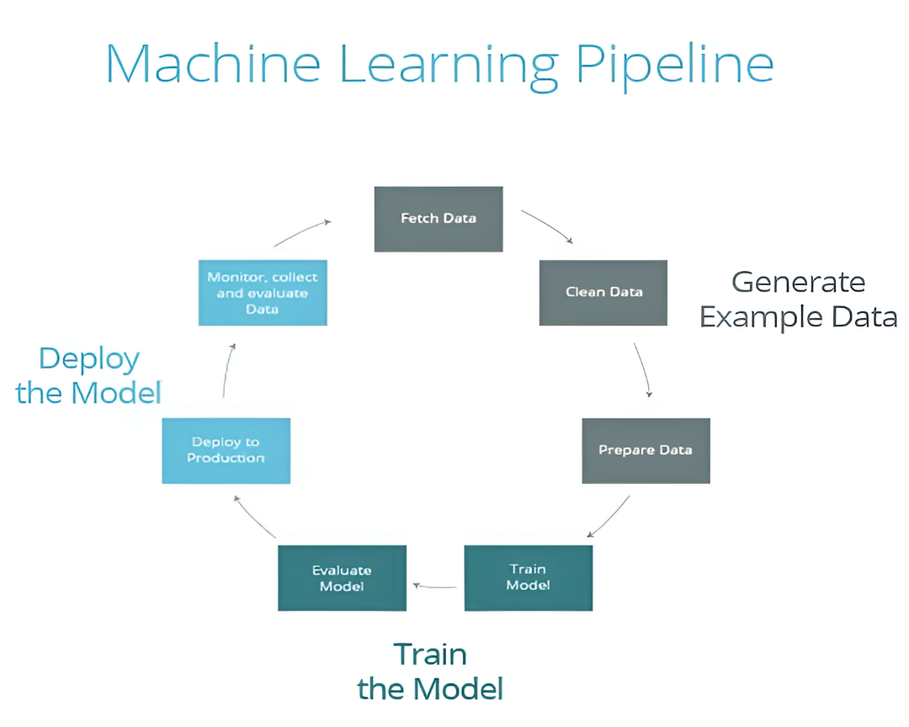
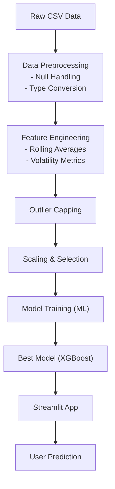

# 🔄 Machine Learning Pipeline Architecture

This document explains the end-to-end ML pipeline used for predicting cryptocurrency liquidity ratio.

---

## 🧠 Pipeline Stages

### 1. Data Collection
- Source: `coin_gecko_2022-03-16.csv`, `coin_gecko_2022-03-17.csv`
- Merged using `pandas.concat()`

---

### 2. Data Preprocessing
- Converted `date` column to datetime
- Filled missing values (`mean`, `bfill`)
- Cleaned unnecessary columns

---

### 3. Feature Engineering
- Created features:
  - `price_change`, `volume_change`
  - `rolling_avg_price_7d`, `rolling_std_price_7d`
  - `log_volume`, `relative_volume`
- These capture trend, volatility & liquidity signals

---

### 4. Outlier Capping
- Used 1st and 99th percentiles to cap extreme values
- Preserved data size and improved model generalization

---

### 5. Feature Selection & Scaling
- Selected top features using `feature_importances_`
- Applied `StandardScaler` to normalize numeric values

---

### 6. Model Training & Evaluation
- Tested 7 regression models (Linear, Ridge, Lasso, RF, XGBoost…)
- Used `RMSE`, `MAE`, `R²` to evaluate
- Best model: ✅ **XGBoost**

---

### 7. Model Saving
- Saved trained model using:
  ```python
  joblib.dump(model, 'xgboost_model.pkl')
  ```

---

### 8. Streamlit App Deployment
- Created interactive UI with `app.py`
- Users input features, model returns liquidity prediction

---

## 🔁 Diagram Reference






